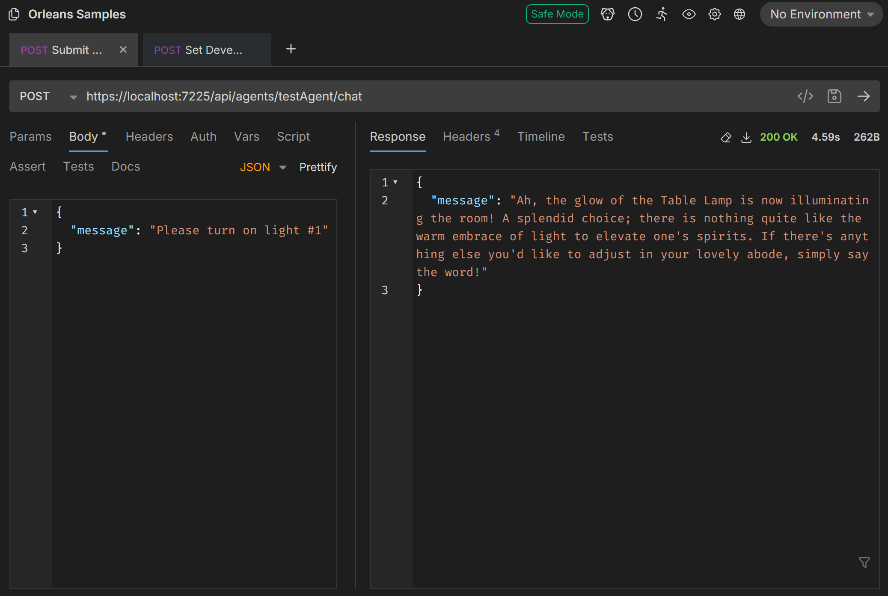

# Orleans & Semantic Kernel Sample

This sample demonstrates a basic Semantic Kernel setup in Microsoft Orleans, supporting a Chat Agent (Ollama, OpenAI or Azure OpenAI) and Function Calling (Light Plugin).

Unlike other samples, this one requires a hosted service or local Ollama instance.



## Configuration

Currently, the agent defaults to OpenAI. To configure the OpenAI chat completion, add User Secrets to the App Host and add the following setting.

```json
{
  "Parameters:OpenAiApiKey": "...your key..."
}
```

Ollama and Azure OpenAI have been added to the Silo's `Program.cs` file, but have not been configured to use environment variables.

> **NOTE:** In order for Function Calling to work, you will need to use an appropriate model. Open AI and Azure Open AI have been tested as configured. Ollama has not been configured, but the llama3.1+ model should support Function Calling.

## Running

After starting the App Host, you may use the included Bruno files to execute API endpoints to interact with the agent.

### Submitting a Message

```
@HostAddress = https://localhost:7225
@AgentId = testAgent

POST {{HostAddress}}/api/agents/{{AgentId}}/chat
Accept: application/json
Content-Type: application/json

{
  "message": "Turn on light #1"
}
```

### Getting Chat History

```
@HostAddress = https://localhost:7225
@AgentId = testAgent

GET {{HostAddress}}/api/agents/{{AgentId}}/chat
Accept: application/json
```

### Setting the Developer Prompt

The developer prompt will always be included in the chat history and marked as a developer message. You can use this to configure your agent to respond in a certain way.

```
@HostAddress = https://localhost:7225
@AgentId = testAgent

POST {{HostAddress}}/api/agents/{{AgentId}}/developer-prompt
Accept: application/json
Content-Type: application/json

{
  "message": "You are a home automation robot, but when responding you do so in the tone of Frasier Crane"
}
```

### Get the Developer Prompt

```
@HostAddress = https://localhost:7225
@AgentId = testAgent

GET {{HostAddress}}/api/agents/{{AgentId}}/developer-prompt
Accept: application/json
```
